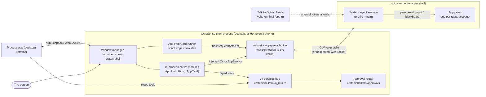
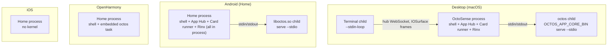
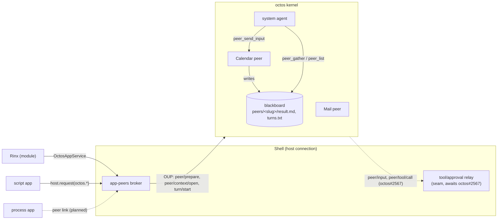
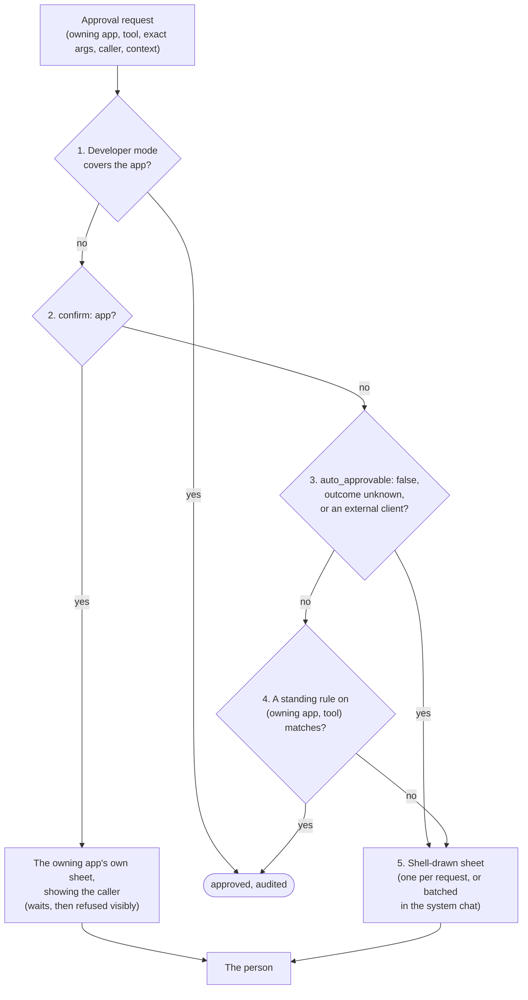

# OctoSense architecture

English | [简体中文](architecture.zh-CN.md)

How OctoSense fits together: which processes run on each platform, where the agents live, how the pieces talk, how tools are granted and approved, where data and secrets are kept, and where the trust boundaries are. It describes `main` on 2026-09-28 (OctoSense `ff40e9c`, which pins octos `5e7577f0`), read in the code.

Every statement carries its status:

- **On main**: merged, read in this repository's code (a path is given).
- **In progress**: an open pull request, linked.
- **Planned**: decided in an ADR (linked, with its plan step) and not built yet.

The decisions behind it are [ADR 0001](adr/0001-one-octosense-repository.md) (one repository), [ADR 0002](adr/0002-event-driven-app-agents.md) (app agents, Proposed, as amended by 0004), [ADR 0003](adr/0003-shared-octos-client-access.md) (Talk to Octos) and [ADR 0004](adr/0004-native-apps-hosting-and-peers.md) (native apps, app agents, cross-app work and approvals, Accepted). The assistant's services, what each kind of app can call today and how to run them locally are in [ai-services.md](ai-services.md); this page does not repeat them.

## Contents

- [The big picture](#the-big-picture)
- [1. Processes per platform](#1-processes-per-platform)
- [2. Agents](#2-agents)
- [3. Communication](#3-communication)
- [4. Tools and grants](#4-tools-and-grants)
- [5. Approvals](#5-approvals)
- [6. Storage and secrets](#6-storage-and-secrets)
- [7. Trust boundaries and isolation](#7-trust-boundaries-and-isolation)
- [8. Worked example: emailing a meeting invite](#8-worked-example-emailing-a-meeting-invite)
- [Where the code and the ADRs disagree](#where-the-code-and-the-adrs-disagree)
- [Source map](#source-map)

## The big picture



```
+--------------------------- OctoSense shell process ----------------------------+
|  window manager / launcher / sheets        approval router      AI services bus |
|  in-process modules: App Hub (+ Card runner with script apps), Rinx, (AppCard)  |
|  ai-host + app-peers broker  == host connection ==+                             |
+---------------------------------------------------|-----------------------------+
        ^ hub: loopback WebSocket                   | OUP: stdio (default) or
        |                                           | WebSocket with the host token
+-------+---------+                  +--------------v--------------------------+
| process apps    |                  | octos kernel (child; in process on OHOS)|
| Terminal, ...   |                  |   system agent session                  |
+-----------------+                  |   app peers: one per (app, account)     |
                                     |   tools run as short child processes    |
   Talk to Octos clients  ---------> +-----------------------------------------+
   (external token, allowlist, opt-in)
```

## 1. Processes per platform

### The shell

One Makepad process per device: the desktop (`desktop/`, package `octosense`) or Home on a phone (`phone/`, package `octosense-home`), both linking the one shell crate `crates/shell` ([ADR 0001](adr/0001-one-octosense-repository.md)). The shell owns the window manager, the launcher, the host sheets, the approval router, app storage and the kernel's host connection.

### The octos kernel

Each shell runs at most one [octos](https://github.com/octos-org/octos) kernel, a shell service in [`crates/kernel`](../crates/kernel/README.md) (package `octosense-kernel`), reached through [`crates/ai-host`](../crates/ai-host/README.md). **On main.** How it runs (`crates/kernel/src/launch.rs`, `launch::resolve`):

| Platform | Kernel | How it is started |
| --- | --- | --- |
| Desktop (macOS; Windows and Linux untested) | a child process: the `octos` binary named by `OCTOS_APP_CORE_BIN` (or the embedder's `Options::program`) | `serve --stdio --data-dir <core dir>`; without a binary there is no kernel (no `PATH` lookup). Shipping the binary with the desktop is in progress ([#85](https://github.com/OctoSense-org/OctoSense/pull/85)). |
| Android (Home) | a child process: the APK's bundled `liboctos.so`, built by [`tools/kernel-artifact.py`](../tools/kernel-artifact.py) at the pinned octos revision | `serve --stdio`, found next to `libmakepad.so` in the app's native library directory |
| OpenHarmony | in process: `octos_cli::embedded::serve_io` as a task over an in-memory duplex (a HAP may not exec) | same protocol, no child |
| iOS | none | the providers are saved; no app gets an assistant |

Its lifecycle (`crates/kernel/src/lib.rs`, `kernel.rs`):

- **Lazy start, shared.** Nothing runs until the first consumer calls `connect()`; later consumers attach to the same generation. A new generation waits until the previous one has exited, so octos's single-writer lock on its data directory is released first.
- **Restart on provider change.** The `llm` host service rewrites the profile and calls `restart()`: every connection ends with `CloseReason::Restarted` and the consumers reconnect to a fresh kernel.
- **Idle stop.** With Talk to Octos off, the kernel stops when the last connection closes. With it on, it keeps running until the person turns it off or the shell exits.
- **Exit with the shell.** The shell holds the child's stdin for its whole life; when the shell exits, crashes or is killed, the kernel reads EOF and stops. In `--host-managed` mode octos also asks for SIGTERM on parent death on Linux and Android (`bind_to_parent()` in octos `crates/octos-cli/src/api/host_managed.rs`); the child is also spawned `kill_on_drop`.
- **A crash** ends every connection with `CloseReason::Exited` (the last stderr lines); nothing restarts it by itself, and the next `connect()` starts a new generation. See [what a kernel crash means](#what-a-kernel-crash-means).

### Native apps: in process or their own process

Native apps are first-party Rust crates declared only in [`native-apps.json`](../native-apps.json); `tools/native_apps.py` generates `crates/shell/src/native_apps.rs` and the Cargo blocks from it and checks them in CI (ADR 0004 §1, plan step 1). **On main.** The manifest today:

| App | Hosting on macOS / Windows | Linux | Android, iOS, OpenHarmony | Desktop / phone | Assistant |
| --- | --- | --- | --- | --- | --- |
| App Hub (`apphub`: the store and the Card runner) | in process | in process | in process | default / default | – |
| Rinx | in process | in process | in process | default / default | granted the four `octos.*` services |
| Terminal | **own process** | own process with a Vulkan build and a Wayland session, else in process | in process | default / off | – (its `run` tool is `confirm: host`, `auto_approvable: false`) |
| Sheets, Reference | in process | in process | in process | opt-in / `mobile-apps` | – |
| AppCard | in process | in process | in process | opt-in / opt-in | its own kernel connection |

So **only the Terminal is a process app**, and only on the desktop; `tools/native_apps.py` refuses plain `process` on Linux (`process-if-vulkan` only), so Linux without Vulkan and Wayland runs every app in process. App Hub stays in process because it hosts the Card runner every script app runs in; Rinx stays in process until the peer link and the process sandboxes exist (ADR 0004 §2).

How the shell decides at run time (`crates/shell/src/apps.rs`, `AppRegistry::hosting`): if the target cannot run processes (`host::processes_available()` is false on wasm and native mobile), every app is a module; App Hub and Settings are always modules; otherwise a native app follows its manifest entry, and runs as a process only when a process form exists (a checkout to `cargo run` from, or a sibling binary). Release packages do not ship process apps' binaries yet ([#94](https://github.com/OctoSense-org/OctoSense/pull/94), in progress), so there they fall back to in-process. A per-app override (`~/.makepad/wm/apps.splash`, `--module <id>`) can switch a module to a process.

**Process hosting** is Makepad's window-manager hosting (`crates/shell/src/clients.rs`, `hub.rs`):

- The shell starts the app as a child with `--stdin-loop` (`cargo run … -- --stdin-loop` in a checkout, else the sibling binary), in its own process group, with `STUDIO_HOST=http://127.0.0.1:<hub port>` and its client id.
- The child connects back to the shell's **hub**, an HTTP/WebSocket server the shell binds on the first free loopback port in 8765–8785 (`WmHub::start`), and speaks Makepad's studio protocol (`AppToStudio` / `StudioToApp`).
- Frames reach the compositor without copies where the OS allows (implemented in Makepad `platform/src/os`): IOSurface on macOS, D3D11 shared handles on Windows, DMA_BUF on Linux with Vulkan and Wayland; a Linux OpenGL build reads every frame back through the CPU.
- A process app that dies takes only itself down: the shell removes its client and shows "App stopped". (Only in-process modules get the Restart face today; see [the disagreements](#where-the-code-and-the-adrs-disagree).)

**In-process hosting** (`crates/shell/src/module_host.rs`): each instance of a module gets its own splash isolate (`alloc_splash_vm_with_network`) and storage namespace. The isolate separates the script heap only; the module's Rust code shares the shell's memory. Every call into a module runs under `catch_unwind` (`contain`, `contain_outside`): a panic marks that module failed, answers its in-flight tool calls "outcome unknown", closes its extra windows and shows a Restart face, while the shell keeps running ([#114](https://github.com/OctoSense-org/OctoSense/pull/114), ADR 0004 step 9). **On main.**

### Script apps

Script apps (the system apps News, Photos, Maps, Camera on phones, Mail, AI providers and YouTube, from `desktop/system-apps.json` and `phone/system-apps.json`, plus store apps) are OctoScript bundles. They all run in process, inside App Hub's **Card runner** (`CARD_MODULE` of `octosense-app-hub-app`): one nested isolate per app instance with `mod.res` and `mod.run` stripped, a jail and a quota. An app reaches the shell only through `host.request("<family>.<method>", …)` for the families its manifest was granted. A script bug fails inside its isolate. **On main.**



## 2. Agents

**One kernel per shell; agents are sessions, not processes.** Inside the one kernel, every agent is an octos session run as tokio tasks. Tools such as file edits run in the kernel; octos's command tools run as short child processes in the session's workspace (OctoSense denies them to the system agent, [section 4](#4-tools-and-grants)).

| Agent | What it is | Status |
| --- | --- | --- |
| **The system agent** | the session `_main:api:octosense#system` on the `_main` profile (`SYSTEM_SESSION` in `crates/kernel/src/network.rs`). It owns every app peer and supervises them. The person reaches it today through a Talk to Octos client; the shell draws no chat for it yet | On main |
| **An app agent** | one host-owned octos **peer** per (app, account), owned by the system agent (octos UPCR-2026-034, Rinx [ADR 0007](https://github.com/hagency-org/Rinx/blob/main/docs/adr/0007-host-owned-octos-app-peers.md)) | On main for Rinx (native) and for script apps behind a switch; see below |

Each app peer has, separately from every other:

- a **workspace**: the kernel-provisioned folder the peer's session is bound to. ADR 0004 §11 makes it the app's account folder (`apps/<app id>/accounts/<account hash>/`); the broker does not pass that folder to the kernel yet (planned, step 10; see [the disagreements](#where-the-code-and-the-adrs-disagree));
- a **memory namespace** `app/<app>/acct-<hash>` (`app_namespace()` in `crates/app-peers/src/broker.rs`); a kernel that does not return it is refused;
- its own **transcript** and **model** lane (the host sets the model with `peer/prepare` / `peer/model/set`);
- its own **tool list**: today the kernel's peer-safe defaults; the app's own tools and grants arrive with host-registered tools (octos [#2567](https://github.com/octos-org/octos/pull/2567), open; OctoSense plan step 6);
- **request contexts** (`peer/context/open`): one per client instance (a Rinx mini app, a card thread), each with its own transcript, folder `contexts/<id>/` inside the peer's workspace and child memory namespace. A context cannot read the files beside it.

Who gets a peer today (`crates/ai-host/src/lib.rs`, `Policy::shipped()`; `crates/app-peers/src/hosted.rs`, `effective_services` = declared ∩ supported ∩ policy):

- **Rinx**, the only native app granted the assistant (the four `octos.*` services), after first-use consent.
- **Script apps** that declare `octos.*`: one peer `card.<app id>` each, account `device` (`crates/ai-host/src/contained.rs`, [#106](https://github.com/OctoSense-org/OctoSense/pull/106)), only while `Policy::contained_apps` is on (off in the shipped policy; `OCTOSENSE_CONTAINED_APPS=1` turns it on) and the person consented at first use.
- **AppCard** (opt-in) takes its own kernel connection and sessions, not a peer.
- Process apps get no agent yet: the offer is made only in `ModuleHost::create` (the peer link is planned, step 8).

Peers are kept, not thrown away: the broker resumes a peer with its host token (stored under `<core dir>/../app-peers`, 0600), and never calls `peer_close` on sign-out, because octos cannot resume a closed peer or create a replacement for its (app, account) (ADR 0004 §11).

### What a kernel crash means

Every agent is in the one kernel, so a kernel crash stops **all** of them at once: the system agent and every app peer, mid-turn. The shell and its apps keep running; `availability()` reports the assistant failed, apps' ordinary UI keeps working, and in-flight turns end with the connection. Nothing is lost that octos had persisted: sessions, blackboards, memory namespaces and peer bindings are in the kernel's data directory, so the next `connect()` starts a new generation and consumers reopen and resume their peers and contexts with the stored host tokens. A tool call whose outcome is unknown is never retried without the person (ADR 0004 §7).

## 3. Communication



### OUP between the kernel and its clients

The kernel speaks the **octos UI protocol** (OUP; `octos-ui/v1alpha1`, JSON-RPC 2.0 frames; octos [`api/OCTOS_UI_PROTOCOL_V1_SPEC_2026-04-24.md`](https://github.com/octos-org/octos/blob/main/api/OCTOS_UI_PROTOCOL_V1_SPEC_2026-04-24.md)). **On main.**

- **Default: stdio.** The shell is the only client, over the child's stdin and stdout (newline-delimited JSON; octos UPCR-2026-016). Inside the shell, `crates/kernel/src/router.rs` multiplexes one frame stream between native consumers: each request gets a kernel-unique id and its reply goes back to that consumer only; notifications go to the consumers that named the session.
- **Talk to Octos: host-managed WebSocket** ([ADR 0003](adr/0003-shared-octos-client-access.md), [#98](https://github.com/OctoSense-org/OctoSense/pull/98); octos [`docs/HOST_MANAGED_SERVE.md`](https://github.com/octos-org/octos/blob/main/docs/HOST_MANAGED_SERVE.md), UPCR-2026-036). When the person turns it on in AI providers (`<core dir>/external-access.json`), the shell restarts the kernel as `octos serve --host-managed --host 127.0.0.1`, on a listener the shell binds once and passes down (`--listen-fd` on Unix). It writes two tokens as the first two lines of the kernel's stdin, never in the environment:

  | Token | Holder | May |
  | --- | --- | --- |
  | **Host token** | the shell process only; minted per shell lifetime, never logged | everything (admin); native consumers connect with it to `/api/ui-protocol/ws` |
  | **External token** | a paired web client (8-character code on the trusted sheet, 5 minutes, one claim) or a terminal client of this user (the 0600 `client-connection.json`) | only `/api/ui-protocol/ws`, as `_main`, and there only an allowlist of methods: open and read the system conversation, start, steer or interrupt its **own** turns, answer its own turns' approvals (once-only) and questions |

  External clients may not: call any `peer/*` method or name an app peer's session (`peer-…`, `peerctx-…`); set `cwd`, `topic` or `sandbox`; touch providers, keys, models, skills, snapshots or `server/shutdown`; use REST or admin routes. Their turns get a fixed tool set (file tools, `web_search`, `web_fetch`, memory reads, `ask_user_question`, media viewing; mirrored in `EXTERNAL_TURN_TOOLS` in `crates/kernel/src/system_tools.rs`): no shell, no peer tools, no host-routed tools (octos [#2601](https://github.com/octos-org/octos/pull/2601)). Not on OpenHarmony or iOS; Android unverified.

### System agent and app agents, inside the kernel

octos's peer mechanism, depth 1 (peers cannot create, steer or close peers). **On main** in octos; the tools are in octos `crates/octos-agent/src/tools/`.

- **System agent → app agent.** `peer_send_input` (originator only, at most 64 KB) delivers text as the peer's next user turn, through the peer's inbox (a durable queue in serve, drained every few seconds, at least once).
- **App agent → system agent: the blackboard.** Each peer turn writes `peers/<slug>/result.md` (plus `result-<n>.md`) and a line in `turns.txt`; the system agent reads them with `peer_gather` and `peer_list` (`awaiting_input` shows a peer waiting on a question). It is the only cross-peer channel.
- **Questions.** A peer asks with `ask_user_question`; the system agent answers with `peer_respond`. `peer_respond` never answers approvals (octos refuses). Host-driven turns lose `ask_user_question`, so ADR 0004 §6 adds a shell tool **`host.ask`** that the shell routes to the system agent or to the app's conversation. **Planned** (step 6).

### The host-owned path: `peer/input`

For a host-owned peer, a plain `peer_send_input` runs as a kernel continuation without the app's tools or memory. ADR 0004 §6 fixes that: octos delivers the system agent's input to the host's driving connection as **`peer/input {peer, session_id, input_id, turn_id, text}`**, and the shell starts the turn itself (`turn/start` with the kernel's `turn_id`), so it runs with the app's tools, memory and context and its approvals surface in the app. If no host connection holds the peer, octos tells the system agent the app is not connected. **In progress**: the kernel side is octos [#2567](https://github.com/octos-org/octos/pull/2567) (open, draft; not on octos `main`); the shell side is plan step 6 and is not on OctoSense `main` (no `peer/input` handler exists).

### An app and its own agent

| Hosting | Channel | Status |
| --- | --- | --- |
| In-process native module (Rinx) | the **injected service**: `ai_host::offer` before `create`, `octosense_app_peers::injection::claim` inside it, giving a scoped `OctosAppService` (`Open`, `History`, `Turn`, `Interrupt`, `Approval`); the module never sees the protocol | On main |
| Script app | `host.request("octos.session.open" / "octos.session.history" / "octos.turn.start" / "octos.turn.interrupt", …)` to the `octos` host service (`crates/ai-host/src/contained.rs`); gated by the manifest, `Policy::contained_apps` and first-use consent (`consent_for_contained`); tool approvals its peer raises are declined and listed in `denied_approvals` | On main ([#106](https://github.com/OctoSense-org/OctoSense/pull/106), consent from [#120](https://github.com/OctoSense-org/OctoSense/pull/120)) |
| Native app in its own process | the **peer link**: its own channel on the app's hub connection (`PeerRequest`, `PeerReply`, `PeerToolCall` with the identity and caller stamped by the shell), never registered with the AI bus; client API in Makepad's `makepad-ai-services` | Planned (ADR 0004 §5, step 8); nothing in `hub.rs` yet |

### Makepad's AI services bus vs OctoSense's app agents

Two models live side by side (ADR 0004, "Two AI models"):

| | Makepad AI services bus | OctoSense app agents |
| --- | --- | --- |
| Where | the window manager's half in `crates/shell/src/ai_bus.rs`; upstream `libs/ai/services` | `crates/ai-host`, `crates/app-peers`, the octos kernel |
| Shape | **one central conversation** (the desktop's AI pane, Makepad's `aichat`) calls typed tools that apps register with a risk level (`Read`, `Act`, `Destructive`) | **one agent per app** with the app's full context (workspace, memory, history, tools), supervised by the system agent |
| Routing | the shell stamps each up-frame with the sender's endpoint, forwards registrations to the pane (replayed on reconnect), routes the pane's calls to the app's socket, and answers the `os` service (list, launch, focus, close, open) itself | the broker talks OUP to the kernel directly |
| Used for | the AI pane on the desktop; Rinx's assistant tools today; the Terminal's `run`. Its `confirm: host` calls go through the shell's approval router ([#120](https://github.com/OctoSense-org/OctoSense/pull/120)) | the apps' own assistants; delegation from the system agent |

**Why app-agent traffic does not use the bus.** The bus is a narrow, one-way API to a central agent that holds all the context; an app agent needs its app's full context and a private, supervised session, and the system agent must address it through the kernel's peer mechanism. The bus also carries no account, request context or caller, so it cannot stamp the identity ADR 0004 §5 requires on every tool call, and its registrations are visible to the pane. So in OctoSense the bus is not the system agent's channel to apps; it stays for upstream Makepad apps (ADR 0004 §6), and the peer link for process apps is deliberately a separate channel. Neither `crates/ai-host` nor `crates/app-peers` uses the bus.

## 4. Tools and grants

**The manifest declares, the person grants at install, the shell enforces on every call** (ADR 0004 §12, ADR 0002 §4). A script app declares capabilities in `manifest.json` and its tools in `tools.json` (admitted and pinned by App Hub); a native app declares them in its reviewed `native-apps.json` entry (`agent.octos`, `agent.tools`, `agent.tool_policy`).

Where an agent's tools come from:

| Source | Example | Runs | Status |
| --- | --- | --- | --- |
| The app's own tools (`tools.json`: name `<app>.<tool>`, schemas, `risk`, `confirm: host` or `app`, `shareable`) | `mail.send`, `rinx.message.send` | the app's host service, module or process, called by the shell | Planned for agents (step 6, needs octos#2567). Rinx's tools reach the AI pane over the bus today |
| The system toolbox, by capability (`research`, `crawl`, `model`) | `toolbox.search`, `toolbox.web_read`, `toolbox.deep_crawl`, `workflow.run` | host | In progress ([#108](https://github.com/OctoSense-org/OctoSense/pull/108)); `model` not registered yet |
| octos's generic tools | file reads fenced to the workspace, memory, `web_search`, `deep_search` | octos | On main as octos's peer-safe defaults; per-app `generic_tools` lists planned (step 6) |
| Other apps' shareable tools, routed by the shell | Calendar's agent calling `mail.send` | the owning app, via the shell | Planned (ADR 0004 §7, step 6) |
| Command execution | `terminal.run` (the Terminal's shareable tool: `confirm: host`, `auto_approvable: false`) | host tool, in a terminal the person sees | Planned as a host tool (steps 6 and 11); the constant exists (`COMMAND_EXECUTION_TOOL`) |

**The system agent's tool set** (`crates/kernel/src/system_tools.rs`, [#117](https://github.com/OctoSense-org/OctoSense/pull/117)). **On main**, partly enforced:

- Its default list, `SYSTEM_AGENT_TOOLS`: supervision (`peer_send_input`, `peer_gather`, `peer_list`, `peer_respond`, `peer_close`; not `peer_handoff`), its workspace's file tools, `ask_user_question` and media viewing, memory, `web_search` / `web_fetch`, `tool_search`. Grants add to it (`SystemAgentTools`: toolbox tools, other apps' shareable tools, command execution).
- **octos's own shell is never offered.** Before every kernel start `enforce` writes the `_main` profile's `tool_policy`, denying `group:runtime` (`shell`, `bash`, `exec_command`, `write_stdin`). It replaces only a policy OctoSense wrote and refuses the person's own octos home.
- **Not yet exact.** octos has no per-session tool list the host can set, so the system agent gets every other tool octos registers; the exact-list test is kept but ignored until octos#2567.
- **Command execution from Settings** (off by default, each command approved live) is a seam: `SystemAgentTools::grant_command_execution` exists; no Settings switch sets it and host tools cannot be registered before octos#2567.

**External clients** get only octos's fixed allowlist ([section 3](#oup-between-the-kernel-and-its-clients)); host-routed tools, developer grants and `dev.run` never reach them.

## 5. Approvals

**A grant is not an approval.** A grant says an agent may *have* a tool; an approval says *this* call, with these exact arguments, may run. Read and in-app act tools run once granted; an outward or destructive call (send, post, share, buy, delete, run a command) needs the person, live or by a standing rule. Only the person approves; the system agent never does, and an agent's own text is never an approval surface (ADR 0004 §8).

**The approval router** (`crates/shell/src/approvals/router.rs`, [#120](https://github.com/OctoSense-org/OctoSense/pull/120)) is the shell's one place that answers approval requests, on their exact arguments. **On main.** For each request, in order:



1. **Developer mode** (`dev_hooks.rs`, `crates/shell/src/dev_mode.rs`, [#118](https://github.com/OctoSense-org/OctoSense/pull/118)) approves everything of the apps it covers, `auto_approvable: false` and `confirm: app` included, never for an external client. Only the person turns it on: a development build with `OCTOSENSE_DEV_MODE=all` (or a list of apps), a release build only with `--dev-grant-all`, or the desktop's Developer options with a typed phrase; store builds never. It shows a banner, audits every call, and ends after 8 hours or at restart outside a developer profile. `dev.run` is not registered yet (step 11).
2. **`confirm: app`** tools go to the owning app's own sheet (an `AppConfirm` the app registers with `register_app_confirm`), with the caller; no rule answers them. An app that has not registered one gets 120 s (`app_wait_s`), then the call is refused visibly. No app registers one on `main` yet; Rinx's send sheet still answers inside Rinx.
3. **`auto_approvable: false`**, **outcome unknown** and **external clients'** calls always go to the person.
4. **Standing rules** (`rules.rs`), keyed on **(owning app, tool)** whoever calls, with conditions on the exact arguments (recipients in contacts or in the thread, no attachments, triggered by the person, count or amount limits; a condition fails when the call lacks the fact), a daily cap (20 by default for a tool rule), a time box of at most 60 minutes for the broadest rule ("everything this app asks for the next hour"; there is no "everything, forever"), and one "all rules off". Contacts come from Mail's host service data (the person's own accounts and the addresses they sent mail to; `contacts.rs`), and only after the person turns on "Use my contacts in approval rules" in Settings (off by default); until then "recipients in contacts" never matches. OS address books are a follow-up. Runs started by incoming content are skipped unless a rule opts in. The person creates rules in Settings → Assistant → Approvals (`settings_page.rs`) or from a sheet; the system agent may only suggest one.
5. Otherwise a **shell-drawn sheet** (`sheet.rs`, `view.rs`): each line shows the owning app, the tool, the exact arguments and, for a cross-app call, the calling app; the system agent's `confirm: host` approvals of one request may be batched into one sheet in its chat.

Every decision reaches the relay once and the **audit** (`audit.rs`: one JSON line per decision in `<octosense home>/logs/approvals-audit.jsonl`, owner-only, with a digest of the arguments rather than the arguments; developer mode keeps its own full audit in `logs/dev-audit.jsonl`); every automatic one is also a notification. Rules are in `approvals/rules.json`, consent in `approvals/consent.json`, under the OctoSense home.

**First-use consent** (`consent.rs`): the first time an app asks for its agent, the shell shows what the agent may read and use and where the model runs; Settings lists every app's agent with an off switch (ADR 0004 §4). **On main** for native modules (`consent_for_module`, before the offer in `module_host.rs`) and script apps (`consent_for_contained`).

**What feeds the router today: only the AI services bus.** The pane's calls to `confirm: host` tools listed in `native-apps.json` (today the Terminal's `run`) are held (`bus:<endpoint>:<call id>`) until the router answers. The octos side (`peer/tool/call` and kernel approvals into `relay.rs`) is a seam waiting for octos#2567; `set_relay` is not called on `main`. Until then octos approvals raised in an app's context go to that app: script apps' are declined in `contained.rs`, Rinx's are answered by the person in Rinx, and in developer mode `crates/app-peers/src/host_approvals.rs` answers them for the covered apps (audited).

## 6. Storage and secrets

One host-owned layout for every app, declared by its manifest (`storage` block) and computed only by the shell (`crates/shell/src/app_storage/`, [#115](https://github.com/OctoSense-org/OctoSense/pull/115), ADR 0004 §11). **On main** as an API native modules are offered at `create` (`octosense_app_peers::storage`, like the assistant service):

```
<octosense home>/apps/<app id>/            the app's jail (App Hub's jail root; a native app's sandbox root)
    accounts/<account hash>/               one per account ("device" when the app has none):
                                            the account's data = that account's agent workspace
    common/                                app data not tied to an account
    cache/                                 evictable, not backed up
<octosense home>/secrets/<app id>/         host-owned: tokens, keys, passwords, encryption stores
```

- **The OctoSense home** is the platform's app data directory on a phone, else `~/.octosense` (`OCTOSENSE_HOME` overrides; `crates/shell/src/octosense/paths.rs`). The apps root may be moved with `OCTOSENSE_APP_DATA`; the secrets root is always `<home>/secrets`, and the two never overlap. Directories are 0700 and symlinked components are refused.
- **The account hash** is 128 bits of a domain-separated SHA-256 of the normalized account id (`account_hash`).
- **The agent workspace is the account folder**, by the ADR. Today the folder exists and a module gets it from `AppStorage::agent_workspace`, but the broker does not yet hand it to `peer/prepare` as the peer's `cwd`: peers work in the kernel-provisioned workspace (planned, step 10).
- **Secrets** (`secrets.rs`, `AppStorage::secrets`): the keychain on macOS and iOS (one item per profile, app and key), elsewhere one owner-only (0600) plaintext file per key in `secrets/<app id>/`; the file store also for tests, headless runs and `OCTOSENSE_SECRETS=file`. The Windows, Linux and Android vaults are a TODO. Secrets are never under `apps/`.
- **The startup check** (`check.rs`): no agent workspace may contain or reach `secrets/` (a symlinked workspace or jail, a symlink or hard link into the secrets, the secrets root inside it). A flagged workspace is refused (`agent_workspace` answers `Refused`, for one account or all) until a later start finds it clean; startup continues and nothing is deleted.
- **Sign-out** suspends an account's agent and never closes it: `Storage::sign_out` makes the workspace answer `SignedOut`. It is a seam today (the shell has no account events yet; a module binds its account through `OctosAppService::set_account`); answering tool calls with `signed_out` is planned (step 6).
- **The kernel's own data** is separate: the core dir `<data dir>/octos-home/.octos` (desktop `~/.octosense/octos-home/.octos`, `OCTOS_APP_CORE_DIR` overrides; `crates/kernel/src/dirs.rs`), holding the `_main` profile, sessions, blackboards and memory namespaces. Provider keys are the `llm` service's (macOS keychain, else owner-only files; see [ai-services.md](ai-services.md#ai-providers-and-the-llm-host-service)). Peer host tokens are in `<core dir>/../app-peers` (0600).
- **Script apps** keep App Hub's jail and quota; their secrets live behind host services and host sheets ("Secrets are the host's", AGENTS.md rule 3). Rinx keeps its own data folder until its data moves under this layout ([hagency-org/Rinx#37](https://github.com/hagency-org/Rinx/issues/37)); under an explicit `OCTOSENSE_HOME` the shell points it at `<home>/apps/rinx/data` (`RINX_DATA_DIR`, set in `crates/shell/src/octosense/paths.rs`; an explicit `RINX_DATA_DIR` wins).

## 7. Trust boundaries and isolation

```
 person ── host sheets (keys, PINs, approvals) ──┐
                                                 v
 +------------------------ shell process (trusted) -------------------------+
 |  holds: host token, peer host tokens, provider keys (via llm), secrets   |
 |  checks every call: grants, consent, approvals, audit                    |
 |   +------------------+   +------------------------------------------+   |
 |   | native modules   |   | Card runner: script apps in isolates     |   |
 |   | reviewed, same   |   | (jail, quota, host.request by grant)     |   |
 |   | memory: trusted  |   +------------------------------------------+   |
 |   +------------------+                                                  |
 +-------|------------------------------------------|-----------------------+
         | hub (loopback)                           | OUP, host token
 +-------v----------+                      +--------v--------------------+
 | process apps     |                      | octos kernel                |
 | (OS sandbox:     |                      |  workspace fence per peer   |
 |  planned)        |                      |  external clients: allowlist|
 +------------------+                      +-----------------------------+
```

| Boundary | What holds it | Status |
| --- | --- | --- |
| Script app ↔ shell | App Hub's nested isolate: no `mod.res` / `mod.run`, a jail and quota, only `host.request` for granted families; password fields inert; secrets on host sheets | On main |
| Native module ↔ shell | none in memory: reviewed first-party code only (`native-apps.json`); **panic containment** at the module boundary (`catch_unwind`, [#114](https://github.com/OctoSense-org/OctoSense/pull/114)); limits: a panic while unwinding, `panic = "abort"`, FFI | On main |
| Process app ↔ shell | its own address space; an **OS sandbox** from the manifest's `sandbox` and `storage` (macOS sandbox profile, Linux Landlock and seccomp, Windows AppContainer) | Sandboxes planned (ADR 0004 §3, step 8); today a process app runs with the user's rights |
| App ↔ kernel | apps never speak the kernel protocol and **never see the host token**: modules get a scoped `OctosAppService`, script apps a host service, process apps (planned) the peer link | On main |
| Peer ↔ peer | octos: separate workspace (overlapping workspaces refused), memory namespace, transcript; request contexts fenced to `contexts/<id>/` | On main (octos UPCR-2026-034) |
| Agent ↔ secrets | secrets outside every jail and workspace; startup check | On main |
| External client ↔ kernel | external token, method and tool allowlists, `Host` and origin checks, no peer access | On main ([ADR 0003](adr/0003-shared-octos-client-access.md)) |

**What the shell checks on every call** (ADR 0004 §3): grants and consent; budgets, rate limits and background policy; each tool call's name and arguments against the declared `tools.json`; each result against its schema and size; its own audit; crash cleanup. On main today: consent, the `octos.*` service grants by exact name (declared ∩ supported ∩ policy), argument rules and size caps for script apps (text at most 32 KiB, replies at most 2 MiB), the approval router and audit for bus calls. Tool-call schema checks and budgets come with host-registered tools (step 6).

**What nobody can check**: what a native app's code does inside its own tool, or why it starts a turn. Review and, for process apps, the sandbox are the controls.

## 8. Worked example: emailing a meeting invite

"Ask the system agent to email a meeting invite." This is ADR 0004's Calendar and Mail example. **Almost all of it is planned**: there is no Calendar app on `main`, Mail declares no `tools.json` or `octos.*` yet, and the kernel side (`peer/input`, host-registered tools) is octos#2567. The status column says which pieces exist.

```mermaid
sequenceDiagram
  actor P as Person
  participant S as System agent
  participant SH as Shell (host connection)
  participant C as Calendar agent (peer)
  participant R as Approval router
  participant M as Mail (host service)
  P->>S: "Invite Ana, Bo and Edward to Tuesday 3 pm"
  S->>C: peer_send_input (brief)
  Note over S,SH: octos delivers peer/input to the host
  SH->>C: turn/start (app's tools, memory, context)
  C->>SH: peer/tool/call calendar.create_event
  SH-->>C: result
  C->>SH: peer/tool/call mail.send x3 (caller: Calendar)
  SH->>SH: grant check: Calendar granted mail.send?
  SH->>R: approval (Mail, mail.send, exact args, caller Calendar)
  alt standing rule on (Mail, mail.send) matches
    R-->>SH: approved (notified, audited)
  else no rule
    R->>P: one batched sheet with the three invitations
    P-->>R: approve
  end
  SH->>M: execute mail.send x3
  M-->>SH: results
  SH-->>C: peer/tool/result
  C->>C: octos writes peers/(slug)/result.md
  S->>S: peer_gather reads the result
  S->>P: "Booked Tue 3 pm; invitations sent to 3"
```

| Step | What happens | Status |
| --- | --- | --- |
| 1 | The person asks the system agent, in the system conversation `_main:api:octosense#system`. | Reachable today only from a paired Talk to Octos client; the shell has no chat of its own for the system agent yet (the desktop's AI pane is Makepad's `aichat` on the bus, not the system agent) |
| 2 | The system agent plans. Ambiguity is asked, not guessed ("two Edwards?"); for a bounded read it may call a granted tool directly. Work that needs Calendar's judgement goes to Calendar's agent with `peer_send_input`. | `peer_send_input` on main; direct cross-app grants planned (step 6) |
| 3 | octos delivers the input to the shell as `peer/input`; the shell starts the turn on Calendar's peer with `turn/start`, so it has Calendar's tools, memory and account context. If Calendar's peer has no host connection, the system agent is told the app is not connected. | In progress ([octos#2567](https://github.com/octos-org/octos/pull/2567)); shell side planned (step 6) |
| 4 | Calendar's agent calls `calendar.create_event` (its own tool) and Mail's shareable `mail.send` once per invitee. Each call reaches the shell as `peer/tool/call`; the shell stamps the caller (Calendar's agent), account and context. | Planned (ADR 0004 §5, §7; step 6) |
| 5 | The shell checks that Calendar's manifest was granted `mail.send` (at install for a script app); no second, agent-level consent. | Planned (step 6) |
| 6 | `mail.send` is outward and `confirm: host`, so the approval router takes it: developer mode off; not `confirm: app`; not `auto_approvable: false`; a standing rule on (Mail, `mail.send`) such as "send to my contacts" approves it (notified and audited; the contacts condition holds only once the person turned on "Use my contacts in approval rules"), else one batched shell sheet shows each invitation: owning app Mail, tool `mail.send`, calling app Calendar, the exact arguments. | Router, rules, sheets and audit on main ([#120](https://github.com/OctoSense-org/OctoSense/pull/120)); fed by kernel tool calls once octos#2567 lands |
| 7 | On approval the shell hands each call to Mail's host service, which sends with the account the person signed in to on Mail's host sheet (the password never reaches the agent), and returns the result to the kernel as `peer/tool/result`. | Mail's host service on main (`apps/mail/host-service`); its tools as agent tools planned |
| 8 | Calendar's turn ends and octos writes `peers/<slug>/result.md` and `turns.txt`; the system agent reads it with `peer_gather`. A failed invitation is named, and one with an unknown outcome is never retried without the person. | Blackboard on main (octos) |
| 9 | The system agent announces "Booked Tue 3 pm; invitations sent to 3". Calendar's and Mail's own UIs show the change because their data changed. | Planned |

## Where the code and the ADRs disagree

Found while writing this page (2026-09-28); none is fixed here, as this change is documentation only.

1. **Process apps beyond the Terminal.** Fixed: the opt-in Sheets and Reference are `module` on every target, and the generator refuses plain `process` on Linux (ADR 0004 §2).
2. **Restart of a dead process app.** ADR 0004 §2 says its tile shows it closed with a restart. The shell removes the client and posts "App stopped"; the Restart face exists only for in-process modules (`module_view.rs`).
3. **Agent workspace = account folder.** ADR 0004 §11 names it the `peer/prepare` `cwd`. The broker sends no `cwd` to `peer/prepare` and binds the peer to the kernel-provisioned workspace; the storage API's `agent_workspace` is not connected to it. The account folder name (`account_hash`, SHA-256) and the memory namespace tag (FNV-1a in `broker.rs`) are also different hashes of the account.
4. **ADR 0003 "What the profile runs"** says OctoSense configures neither the tool set nor the sandbox. Since [#117](https://github.com/OctoSense-org/OctoSense/pull/117) the shell writes a `tool_policy` denying `group:runtime` into the `_main` profile before every start, so the host's own turns have no octos shell either.
5. **Stale context lines.** Fixed: ADR 0004's context table and the README layout tables no longer list the native News, Maps and Photos modules ADR 0004 step 1 deleted (#113), and [ai-services.md](ai-services.md) now describes `main` on 2026-09-28 (the Card runner's `octos` service from #106, consent from #120; the `Policy::contained_apps` switch is still off by default).
6. **Command execution "turned on in Settings".** Fixed in the docs: `crates/kernel/README.md` and `system_tools.rs` now say it is planned (no Settings switch sets `SystemAgentTools::grant_command_execution`; the host tool needs octos#2567).
7. **`host::processes_available()`'s test** checks only `wasm32` while the function also excludes native mobile.
8. **Approvals, ADR 0004 §8.** Every app tool call is to reach the router through `peer/tool/call`; today only the AI bus feeds it (above). No app registers its own `confirm: app` sheet, so such a call would wait and be refused. The audit keeps a digest of the arguments, not the arguments. The send queue and undo window are not built.
9. **Storage, ADR 0004 §11.** Secrets use the OS keychain only on macOS and iOS (plaintext 0600 files elsewhere). The startup check refuses workspaces that reach the secrets through links or containment rather than looking for a `secrets/` path, and does not stop startup. (Fixed: `storage.accounts` defaults to `false` in both app storage and the consent sheet, which now reads `StorageSpec`.)
10. **Developer mode, ADR 0004 §13.** `dev.run` is not registered; Settings turns it on only for all apps (a chosen list only through `OCTOSENSE_DEV_MODE`); there is no phone gesture; in-process modules still show their own confirmation sheets.

## Source map

| What | Where |
| --- | --- |
| Native app manifest, generator, generated table | [`native-apps.json`](../native-apps.json), [`tools/native_apps.py`](../tools/native_apps.py), [`crates/shell/src/native_apps.rs`](../crates/shell/src/native_apps.rs) |
| Hosting decision, host services | [`crates/shell/src/apps.rs`](../crates/shell/src/apps.rs) (`AppRegistry::hosting`, `register_host_services`) |
| Process apps, hub | [`crates/shell/src/clients.rs`](../crates/shell/src/clients.rs), [`crates/shell/src/hub.rs`](../crates/shell/src/hub.rs), [`crates/shell/src/host.rs`](../crates/shell/src/host.rs) |
| In-process modules, panic containment | [`crates/shell/src/module_host.rs`](../crates/shell/src/module_host.rs), [`crates/shell/src/module_panic_tests.rs`](../crates/shell/src/module_panic_tests.rs) |
| AI services bus (shell half) | [`crates/shell/src/ai_bus.rs`](../crates/shell/src/ai_bus.rs) |
| Approvals, consent, audit, Settings page | [`crates/shell/src/approvals/`](../crates/shell/src/approvals/mod.rs) |
| Developer mode | [`crates/shell/src/dev_mode.rs`](../crates/shell/src/dev_mode.rs) |
| App storage, secrets, startup check | [`crates/shell/src/app_storage/`](../crates/shell/src/app_storage/mod.rs) |
| Kernel service: launch, dirs, Talk to Octos, frame router, system agent tools | [`crates/kernel/src/`](../crates/kernel/README.md) (`launch.rs`, `dirs.rs`, `network.rs`, `router.rs`, `system_tools.rs`) |
| Shell AI entry point, policy, offer; script apps' `octos` service | [`crates/ai-host/src/lib.rs`](../crates/ai-host/src/lib.rs), [`crates/ai-host/src/contained.rs`](../crates/ai-host/src/contained.rs) |
| App peers: broker, hosted launch, storage contract, injection | [`crates/app-peers/src/`](../crates/app-peers/README.md) (`broker.rs`, `hosted.rs`, `storage.rs`, `injection.rs`, `host_approvals.rs`) |
| Script system apps per shell | [`desktop/system-apps.json`](../desktop/system-apps.json), [`phone/system-apps.json`](../phone/system-apps.json) |
| octos: host-managed serve, UPCRs, peer tools | [`docs/HOST_MANAGED_SERVE.md`](https://github.com/octos-org/octos/blob/main/docs/HOST_MANAGED_SERVE.md), [UPCR-2026-034](https://github.com/octos-org/octos/blob/main/docs/OCTOS_UI_PROTOCOL_CHANGE_REQUEST_UPCR_2026_034_HOST_APP_PEERS.md), UPCR-2026-035 ([octos#2567](https://github.com/octos-org/octos/pull/2567), not on `main`), [UPCR-2026-036](https://github.com/octos-org/octos/blob/main/docs/OCTOS_UI_PROTOCOL_CHANGE_REQUEST_UPCR_2026_036_HOST_MANAGED_SERVE.md), [`crates/octos-agent/src/tools/`](https://github.com/octos-org/octos/tree/main/crates/octos-agent/src/tools) |
